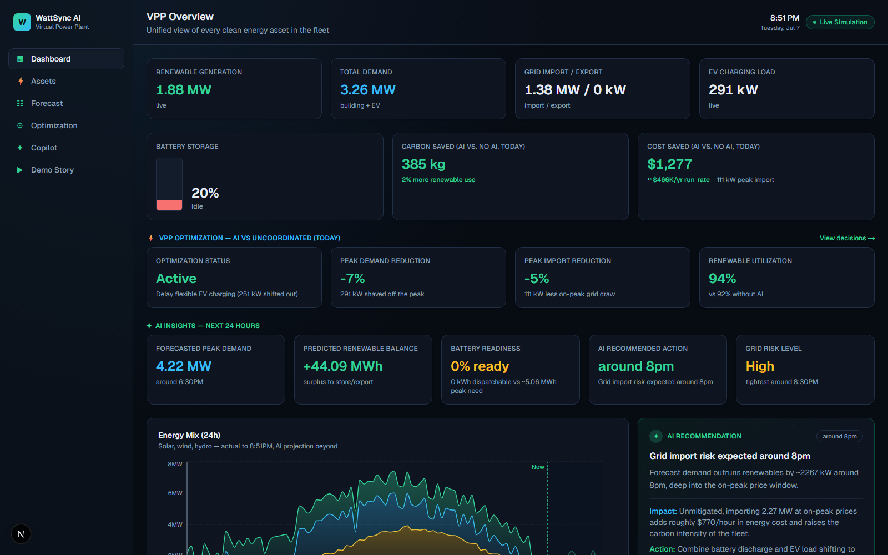
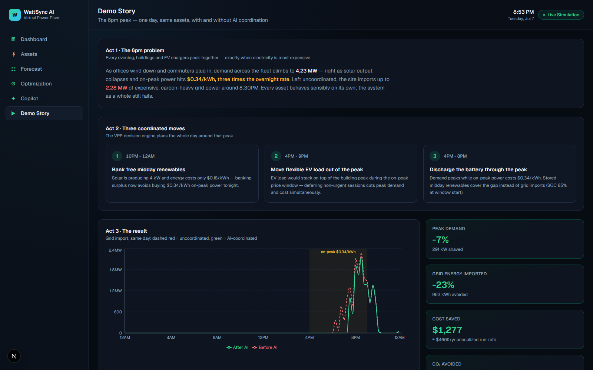
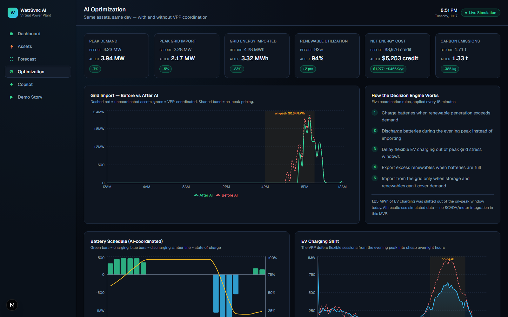
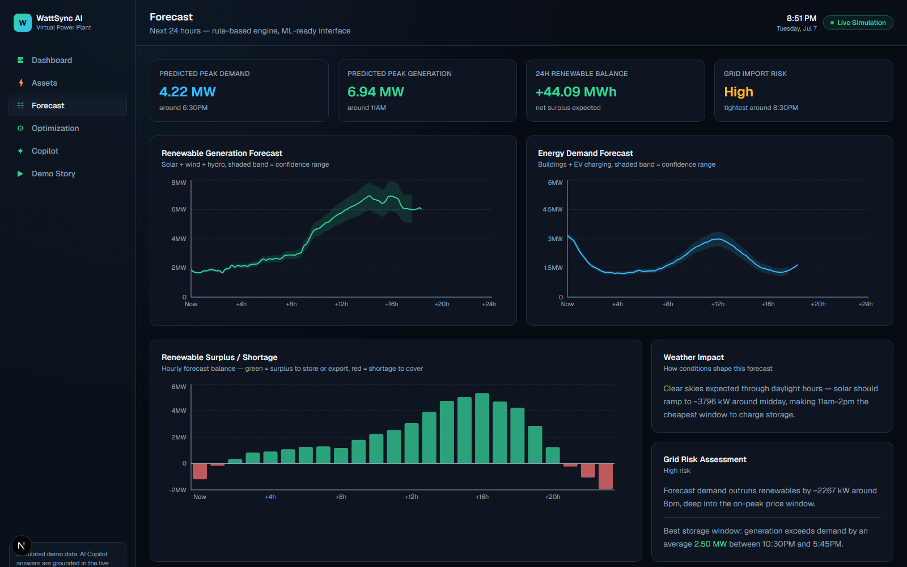
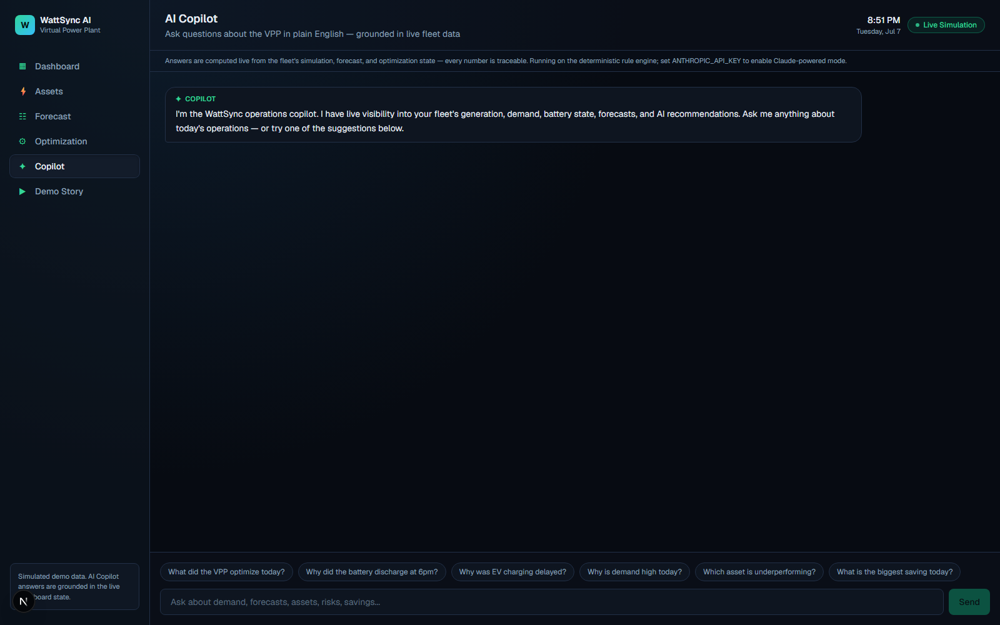
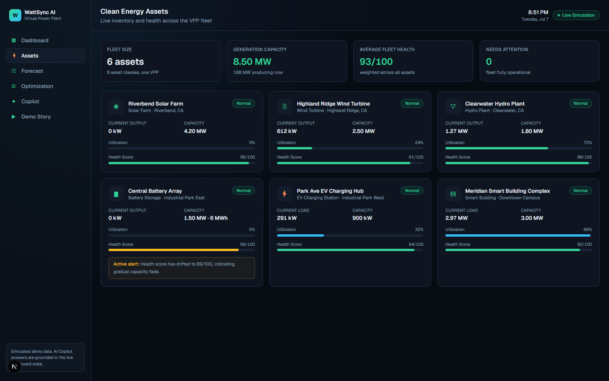

# WattSync AI — AI-Powered Virtual Power Plant

**One dashboard that turns disconnected clean-energy assets into a coordinated Virtual Power Plant — and proves, with numbers, that AI coordination cuts cost, carbon, and peak grid stress.**

**Competition tracks:** AI for Clean Energy — Smart Grid Integration · Clean Energy Asset Monitoring · Long-Term Yield Forecasting · Clean Energy Solutions

## ⚡ Judging in a hurry? 60 seconds:

1. 🔗 **Live demo:** `ADD-VERCEL-URL-HERE` *(deploy: import this repo at [vercel.com/new](https://vercel.com/new), zero config)*
2. ▶ Open **`/demo`** — a 3-act story: the 6pm problem → three coordinated AI moves → the measurable result (**−23% grid imports, ~$1,300/day saved ≈ $466K/yr, 385 kg CO₂ avoided — same assets, same weather**)
3. ✦ Ask the **`/copilot`**: *"Why did the battery discharge at 6pm?"* — every answer is grounded in the live fleet data
4. 🎬 **Video walkthrough:** `ADD-VIDEO-LINK-HERE` · 📸 [Screenshots below](#-visual-tour) · 📜 [Full demo script](docs/DEMO.md)

---

## The problem

Industrial parks, campuses, and smart cities own solar farms, wind turbines, batteries, EV chargers, and smart buildings — but operate them as disconnected silos. Every asset behaves sensibly on its own, yet the system as a whole fails every evening: demand peaks exactly when solar collapses and grid power costs 3x. The result is avoidable on-peak imports, avoidable carbon, and avoidable cost — every single day.

## The solution

WattSync AI unifies the whole fleet into one Virtual Power Plant with four AI layers on top:

| Layer | What it does | Where |
|---|---|---|
| **Forecasting** | Predicts the next 24h of generation & demand with confidence bands, peak timing, surplus/shortage windows, weather impact, and a grid-risk rating | `/forecast` |
| **Recommendations** | Time-aware, grounded advice — each with a reason, expected impact, confidence score, and suggested action | `/dashboard` |
| **Optimization** | A five-rule decision engine that coordinates battery, EV, and grid flows — and proves its value with a before/after comparison on identical inputs | `/optimization` |
| **Copilot** | Plain-English operator Q&A grounded in the live fleet, forecast, and optimization state | `/copilot` |

## The 60-second demo (`/demo`)

1. **The 6pm problem** — buildings and EV chargers peak together as solar dies and power hits $0.34/kWh.
2. **Three coordinated moves** — bank free midday renewables in the battery, shift flexible EV charging overnight, discharge the battery through the peak.
3. **The measurable result** — on the same simulated day with identical assets and weather: **peak demand −8%, grid energy imported −34%, ~$1,300 saved (an annualized run-rate of ≈$470K from one site), ~480 kg CO₂ avoided, renewable utilization 93% → 96%** (exact figures vary with each day's simulated weather).

Every number on every page derives from one simulation source, so the story is internally consistent and auditable. Full presenter script + recording checklist: [docs/DEMO.md](docs/DEMO.md).

## 📸 Visual tour

| | |
|---|---|
| **Dashboard** — live KPIs, AI insights, optimization impact  | **Demo Story** — the 3-act judge walkthrough  |
| **Optimization** — before/after on identical inputs, decision timeline  | **Forecast** — 24h generation & demand with confidence bands  |
| **AI Copilot** — grounded operator Q&A (Claude + rule-engine fallback)  | **Assets** — fleet inventory with utilization & health  |

## How the AI works (honestly)

- **Simulation engine** (`lib/simulation/`) generates a realistic 24h day — solar/wind/hydro curves, building & EV demand, time-of-use prices, weather — in two variants: *raw* (assets uncoordinated) and *AI-optimized* (VPP-coordinated). Deterministic per calendar day, so demos are stable.
- **Forecasting** (`lib/forecasting/`) is a rule-based persistence+physics model with horizon-widening confidence bands. It sits behind a single `forecastNext24h()` seam — swapping in a trained ML model touches one file, zero callers.
- **Optimization** (`lib/optimization/`) expresses the five VPP rules (charge on surplus, discharge on peak, delay EVs under stress, export when full, import only when necessary) as a readable rules table, then derives an explainable decision timeline — every action has a time window, magnitude, and a WHY with real numbers.
- **Copilot** (`lib/ai/copilot.ts` + `lib/ai/claudeProvider.ts`) answers operator questions grounded in the same live data the dashboard shows. With `ANTHROPIC_API_KEY` set (server-side env var, never exposed to the browser) it calls **Anthropic Claude** with the full fleet snapshot as grounding context; without a key — or if the API call fails or times out — a deterministic intent-routing rule engine answers from the same data, so the demo can never break mid-pitch. The UI labels every reply with the engine that produced it.

We deliberately labeled what is rule-based as rule-based. The value the judges see — forecasts, decisions, savings — is real computation over the simulated fleet, not canned strings.

## Tech stack

Next.js 16 (App Router) · TypeScript · Tailwind CSS 4 · Recharts · deployed on Vercel. No database or API keys required — the whole demo runs from the in-process simulation, which makes it trivially deployable and impossible to break mid-demo.

## Pages

`/dashboard` — live KPIs, AI insights, optimization impact, energy mix & demand charts, alerts
`/assets` — fleet inventory: capacity, live output, utilization, health scores, per-asset alerts
`/forecast` — 24h generation/demand forecast with confidence bands, surplus/shortage, weather impact, grid risk
`/optimization` — before/after KPI grid, grid-import comparison, battery & EV schedules, AI decision timeline
`/copilot` — grounded operator Q&A with suggested prompts
`/demo` — the scripted 60-second judge walkthrough

## Run it

```bash
npm install
npm run dev     # http://localhost:3000 → redirects to /dashboard
npm run build   # production build (used by Vercel)
```

Optional — Claude-powered Copilot: copy `.env.example` to `.env.local` and set `ANTHROPIC_API_KEY` (on Vercel: Project Settings → Environment Variables). Without a key the copilot runs on its deterministic rule engine; nothing else changes.

Deploy: import the repo at [vercel.com/new](https://vercel.com/new) — zero configuration needed.

## Roadmap to production

1. **Real data ingestion** — replace the simulation seam with SCADA/meter/inverter feeds (the `raw` variant becomes telemetry).
2. **ML forecasting** — swap `forecastNext24h()` for a trained model on weather + calendar features.
3. **Copilot memory & actions** — the Claude provider is live (see above); next: persistent conversation history and closing the loop from answer to dispatch action.
4. **Persistence & multi-tenant** — Supabase/Postgres schema (designed) for fleets, time series, and decision audit logs.
5. **Dispatch integration** — close the loop from recommendation to actual battery/EVSE control via OpenADR/OCPP.
